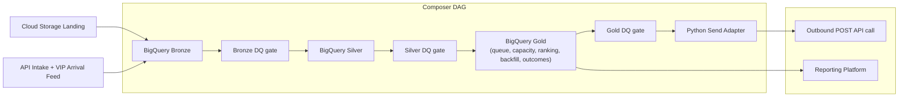

# Architecture Diagram

## Design Intent
- Bronze is immutable and lineage-preserving.
- Bronze DQ validates raw event quality before Silver transformations run.
- Silver creates the patient universe, eligibility flags, priority scoring, and standardized, deduplicated outcome events.
- Silver DQ validates the patient universe and scoring logic before Gold uses it.
- Gold consumes curated Silver outputs and owns queue selection, capacity checks, backfill logic, and appointment outcome reporting.
- Gold DQ validates final dispatch integrity, pacing, and backfill behavior before any outbound API call is triggered.
- Suppression is treated as a vacancy, not a permanent loss, so the next eligible patient fills the slot immediately.
- Python is only a thin adapter for sending vendor messages; business logic remains in SQL in Gold.
- Raw outcome events land in Bronze, are standardized in Silver, and then feed Gold appointment outcome reporting.
