# Composer DAG Visualization

This DAG reflects the simplified final architecture. Bronze creates the raw landing tables, Silver builds the patient universe and ranking model, Gold owns campaign decisioning and pacing, and the send adapter performs the outbound POST only after Gold DQ passes.

```mermaid
flowchart LR
    A[bronze.01_bronze] --> B[dq.01_bronze_dq]
    B --> C[silver.01_silver]
    C --> D[dq.02_silver_dq]
    D --> E[gold.01_gold]
    E --> F[dq.03_gold_dq]
    F --> G[python_apadter.py\nPOST API]

    classDef bronze fill:#eef3ff,stroke:#5b7db0,color:#111,stroke-width:1px;
    classDef silver fill:#ecfdf5,stroke:#2f9e62,color:#111,stroke-width:1px;
    classDef gold fill:#fff4e6,stroke:#d97706,color:#111,stroke-width:1px;
    classDef dq fill:#fdf2f8,stroke:#c026d3,color:#111,stroke-width:1px;
    classDef send fill:#e0f2fe,stroke:#0284c7,color:#111,stroke-width:1px;

    class A bronze;
    class B dq;
    class C silver;
    class D dq;
    class E gold;
    class F dq;
    class G send;
```

## Flow summary

- bronze_load: creates the raw Bronze landing tables and loads intake, VIP arrival, and outcome data.
- bronze_dq: validates raw input quality before Silver runs.
- silver_run: builds the patient universe, eligibility flags, and priority scores in the Silver layer.
- silver_dq: validates patient-universe integrity and scoring logic before Gold consumes it.
- gold_run: creates the Gold dimensional model and applies campaign pacing, ranking, dispatch planning, and backfill logic.
- gold_dq: validates final capacity, uniqueness, eligibility, and backfill behavior before the outbound send.
- send_message: a thin adapter that performs the final outbound POST only after the Gold DQ gate passes.

## Key design note

This diagram intentionally matches the current repo and the simplified design. The Gold layer is now the decision layer, and the DAG is reduced to the real operational flow rather than the older, more fragmented dispatcher-style sequence.
