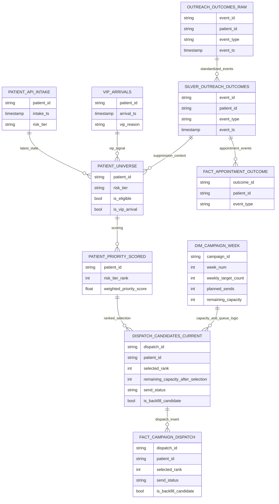
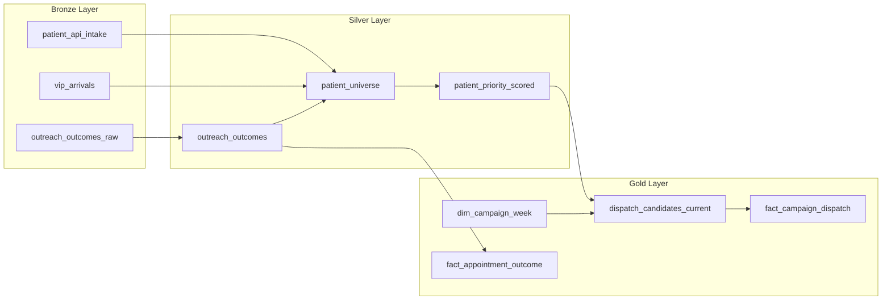

# ERD Graph

```mermaid
erDiagram
    %% =========================
    %% Bronze Layer (sql/bronze)
    %% =========================
    PATIENT_API_INTAKE {
        string intake_batch_id
        timestamp intake_ts
        string patient_id
        string source_system
        string risk_tier
        float risk_score_raw
        bool consent_sms
        bool do_not_contact
        string phone_e164
        date last_pcp_visit_dt
        int chronic_condition_count
        int no_show_count_12m
        string preferred_language
        string payload_json
        timestamp _ingested_at
    }

    VIP_ARRIVALS {
        string arrival_batch_id
        timestamp arrival_ts
        string patient_id
        string risk_tier
        string vip_reason
        string payload_json
        timestamp _ingested_at
    }

    OUTREACH_OUTCOMES_RAW {
        string event_id
        timestamp event_ts
        string patient_id
        string campaign_id
        string event_type
        string event_subtype
        string vendor_status_code
        string appointment_id
        timestamp appointment_dt
        string event_payload_json
        timestamp _ingested_at
    }

    %% =========================
    %% Silver Layer (sql/silver)
    %% =========================
    PATIENT_UNIVERSE {
        string patient_id
        timestamp snapshot_ts
        string risk_tier
        float risk_score_raw
        bool consent_sms
        bool do_not_contact
        string phone_e164
        date last_pcp_visit_dt
        int chronic_condition_count
        int no_show_count_12m
        string preferred_language
        bool is_vip_arrival
        string vip_reason
        bool is_valid_phone
        int days_since_pcp_visit
        bool has_opted_out
        bool already_scheduled
        bool is_eligible
    }

    PATIENT_PRIORITY_SCORED {
        timestamp scored_ts
        string patient_id
        string risk_tier
        bool is_eligible
        int risk_tier_rank
        float risk_score_raw
        int days_since_pcp_visit
        int chronic_condition_count
        int no_show_count_12m
        float weighted_priority_score
    }

    SILVER_OUTREACH_OUTCOMES {
        string event_id
        timestamp event_ts
        string patient_id
        string campaign_id
        string event_type
        string event_subtype
        string vendor_status_code
        string appointment_id
        timestamp appointment_dt
    }

    %% ======================
    %% Gold Layer (sql/gold)
    %% ======================
    DIM_CAMPAIGN_WEEK {
        string campaign_id
        int week_num
        date week_start_date
        date week_end_date
        float cumulative_target_pct
        int cumulative_target_count
        int weekly_target_count
        int planned_sends
        int sent_count
        int remaining_capacity
        string capacity_rule
    }

    DISPATCH_CANDIDATES_CURRENT {
        string dispatch_id
        string campaign_id
        int week_num
        timestamp dispatch_ts
        string patient_id
        string risk_tier
        float weighted_priority_score
        int selected_rank
        int cumulative_capacity_used
        int remaining_capacity_after_selection
        string send_status
        string suppression_reason
        bool is_backfill_candidate
    }

    FACT_CAMPAIGN_DISPATCH {
        string dispatch_id
        string campaign_id
        int week_num
        timestamp dispatch_ts
        string patient_id
        string risk_tier
        float weighted_priority_score
        int selected_rank
        int cumulative_capacity_used
        string send_status
        string suppression_reason
        bool is_backfill_candidate
        string selection_basis
    }

    FACT_APPOINTMENT_OUTCOME {
        string outcome_id
        string campaign_id
        string patient_id
        timestamp event_ts
        string event_type
        string appointment_id
        timestamp appointment_dt
    }

    %% Bronze -> Silver lineage
    PATIENT_API_INTAKE ||--o{ PATIENT_UNIVERSE : latest_patient_state
    VIP_ARRIVALS ||--o{ PATIENT_UNIVERSE : vip_signal
    OUTREACH_OUTCOMES_RAW ||--o{ SILVER_OUTREACH_OUTCOMES : standardized_and_deduplicated
    SILVER_OUTREACH_OUTCOMES ||--o{ PATIENT_UNIVERSE : suppression_context

    %% Silver -> Gold lineage
    PATIENT_UNIVERSE ||--o{ PATIENT_PRIORITY_SCORED : scoring_features
    PATIENT_PRIORITY_SCORED ||--o{ DISPATCH_CANDIDATES_CURRENT : ranked_eligible
    DIM_CAMPAIGN_WEEK ||--o{ DISPATCH_CANDIDATES_CURRENT : capacity_and_queue_logic
    DISPATCH_CANDIDATES_CURRENT ||--o{ FACT_CAMPAIGN_DISPATCH : planned_dispatch_insert

    %% Capacity and outcome lineage
    SILVER_OUTREACH_OUTCOMES ||--o{ FACT_APPOINTMENT_OUTCOME : appointment_events
```

## Notes

- Bronze tables store raw source data and ingestion metadata.
- Silver standardizes and deduplicates outcome events, then uses them for patient eligibility and scoring inputs.
- Gold consumes Silver products for dispatch selection and appointment outcome reporting, and owns queue and capacity decisions.
- A suppression is treated as a vacancy that is immediately backfilled by the next ranked eligible patient, rather than as a permanent loss of capacity.
- Capacity is evaluated using planned and sent volume together so dispatch selection remains consistent and rerun-safe.
- VIP status is treated as a source-driven patient-state signal applied in Silver and used in Gold ranking before dispatch lock-in.

## Slide-Friendly ERD

- Use the full ERD above for implementation detail.
- Use this compact ERD for slides and executive walkthroughs.

## Ultra-Compact Layer View

- This view is intentionally minimal for one-slide storytelling.
- Gold owns the queue and capacity rules; this is the key design boundary.
- A suppression is treated as an immediate vacancy and is backfilled by the next eligible patient in sequence.
- Use the full ERD for schema-level column detail.
